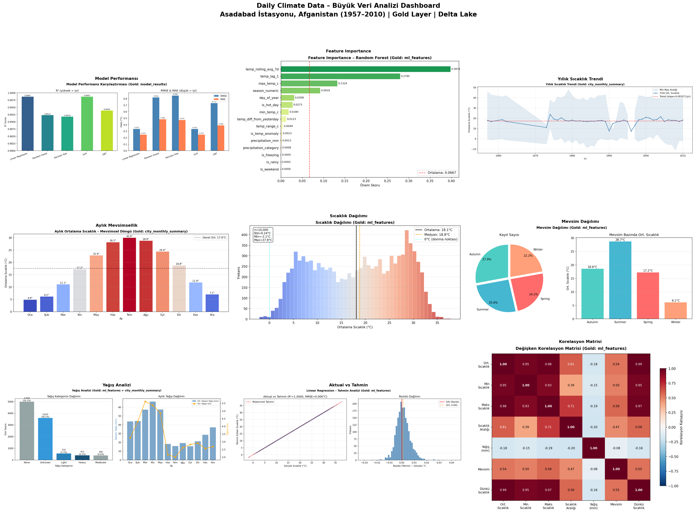
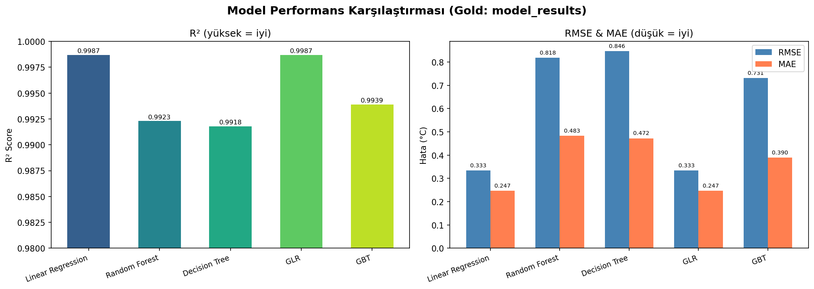
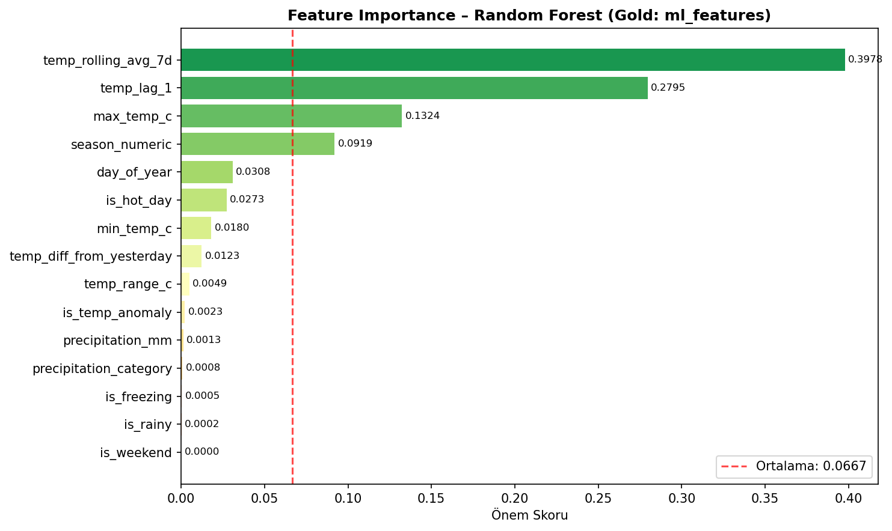
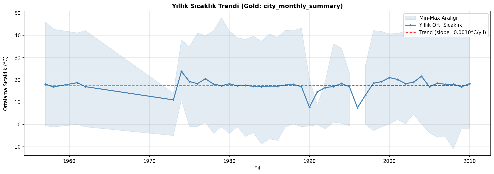
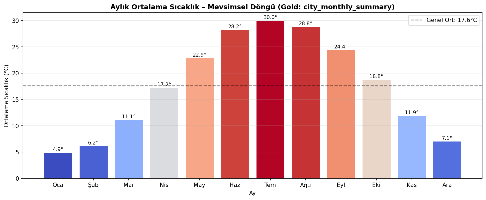
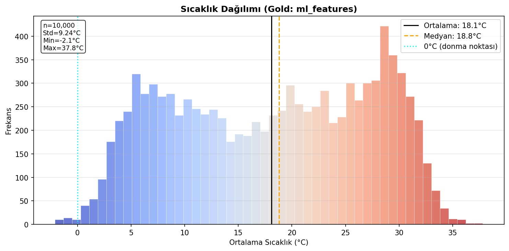
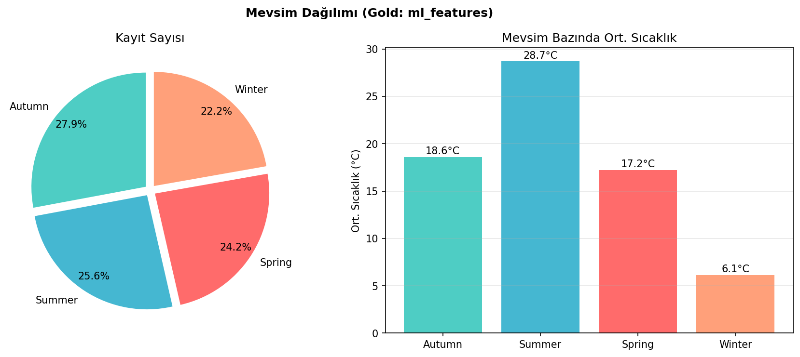
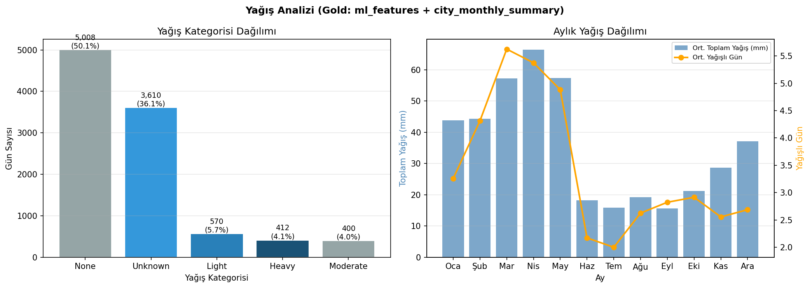
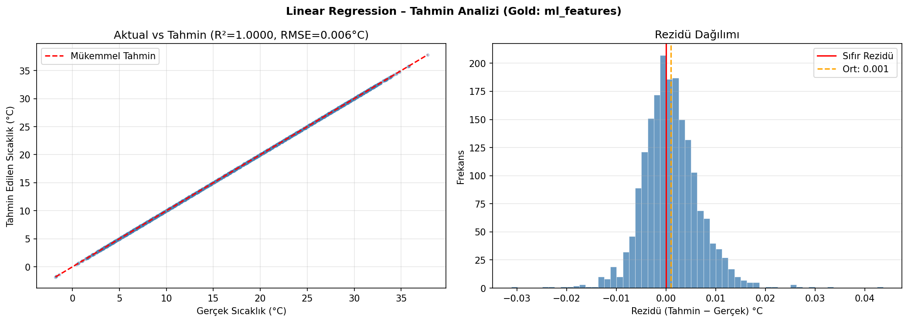
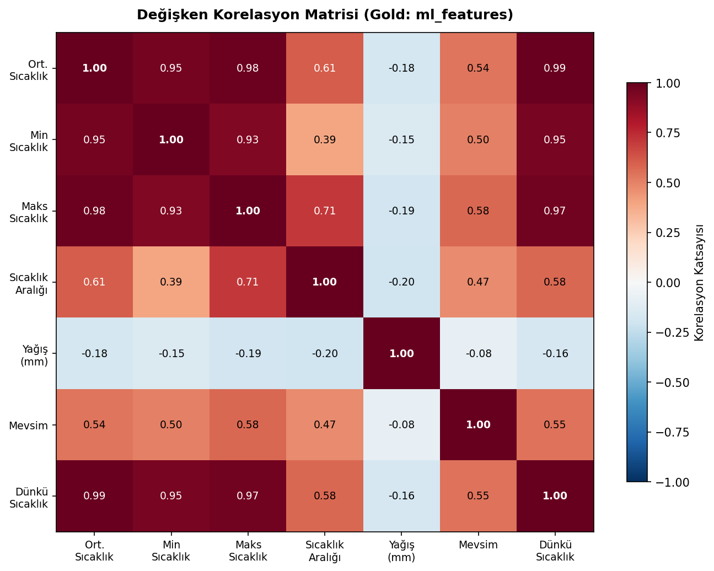

# Daily Climate Big Data Pipeline

Büyük Veri Analizine Giriş dersi dönem projesi — uçtan uca büyük veri mühendisliği pipeline'ı.

Ham iklim verisi bir Kafka akışından geçerek Delta Lake üzerinde Bronze → Silver → Gold katmanlarına dönüştürülüyor; makine öğrenmesi modelleriyle analiz ediliyor ve interaktif bir dashboard'da sunuluyor.

---

## Proje Hakkında

**Veri Seti:** [Global Daily Climate Data](https://www.kaggle.com/datasets/guillemservera/global-daily-climate-data) (Kaggle)
- 27.6 milyon satır günlük hava ölçümü
- 1.234 istasyon, dünya geneli
- 1750–2023 yılları arası
- 14 ölçüm sütunu: sıcaklık, yağış, rüzgar, basınç, kar derinliği, güneşlenme süresi

**Amaç:** Gerçek zamanlı veri akışını simüle ederek büyük veri mühendisliğinin tüm katmanlarını (ingest → process → store → analyze → visualize) uygulamak.

---

## Mimari

```
[Parquet Dosyası]
       │
       ▼
[Kafka Producer] ──────► [Kafka Topic: climate-events]
                                       │
                                       ▼
                            [Spark Structured Streaming]
                                       │
                    ┌──────────────────┼──────────────────┐
                    ▼                  ▼                  ▼
                [Bronze]           [Silver]            [Gold]
             (Ham veri)        (Temizlenmiş)     (Agregasyon + ML)
                                       │
                    ┌──────────────────┼──────────────────┐
                    ▼                  ▼                  ▼
              [ML Modelleri]       [MLflow]          [Dashboard]
              (Spark MLlib)     (Experiment        (Jupyter +
                                 Tracking)          Streamlit)
```

---

## Teknoloji Yığını

| Katman | Teknoloji | Sürüm |
|--------|-----------|-------|
| Konteynerizasyon | Docker + Docker Compose | - |
| Mesaj Kuyruğu | Apache Kafka + Zookeeper | 7.5.0 |
| Veri İşleme | Apache Spark Structured Streaming (PySpark) | 3.5.0 |
| Depolama | Delta Lake (Medallion Architecture) | 3.2.0 |
| ML Eğitimi | Spark MLlib | 3.5.0 |
| ML Takibi | MLflow | latest |
| Görselleştirme | Matplotlib, Plotly, Streamlit | - |
| Dil | Python | 3.11 |

---

## Kurulum

### Gereksinimler

- [Docker Desktop]

### Adım Adım

**1. Repoyu klonla**
```bash
git clone {PROJE}
cd Daily-Climate-Big-Data
```

**2. Veri setini indir**

[Kaggle'dan veri setini indir](https://www.kaggle.com/datasets/guillemservera/global-daily-climate-data) ve `daily_weather.parquet` dosyasını `data/` klasörüne koy:
```
Daily-Climate-Big-Data/
└── data/
    └── daily_weather.parquet   ← buraya
```

**3. Docker Desktop'ı başlat**

Docker Desktop uygulamasını aç ve çalışır duruma gelmesini bekle.

**4. Tüm servisleri ayağa kaldır**
```bash
docker-compose up -d
```

Tüm container'ların ayakta olduğunu doğrula:
```bash
docker ps
```

**5. Jupyter'a bağlan**

Tarayıcıdan [http://localhost:8888](http://localhost:8888) adresine git, token olarak `climate` gir.  
`work/notebooks/` klasöründeki notebook'ları sırayla çalıştır.

---

## Servisler ve Portlar

| Servis | URL | Açıklama |
|--------|-----|----------|
| Jupyter Lab | http://localhost:8888 | Spark notebook ortamı (token: `climate`) |
| Spark UI | http://localhost:4040 | Aktif job izleme (job varken erişilebilir) |
| Kafka UI | http://localhost:8080 | Topic ve mesaj görüntüleme |
| MLflow UI | http://localhost:5000 | Model deneyleri ve metrikleri |
| Streamlit | http://localhost:8501 | İnteraktif dashboard |
| Kafka (iç) | localhost:9092 | Container'lar arası iletişim |
| Kafka (dış) | localhost:29092 | Host'tan Kafka'ya doğrudan bağlantı |
| Zookeeper | localhost:2181 | Kafka koordinasyonu |

---

## Klasör Yapısı

```
Daily-Climate-Big-Data/
│
├── docker-compose.yml          # Tüm servisleri tanımlayan ana dosya
│
├── producer/
│   ├── producer.py             # Parquet → Kafka JSON akışı
│   ├── Dockerfile
│   └── requirements.txt
│
├── notebooks/
│   ├── 01_docker_setup.md      # Adım 1–2: Altyapı tasarım notları
│   ├── 03_spark_streaming.ipynb# Adım 3: Kafka → Bronze → Silver → Gold
│   ├── 04_eda.ipynb            # Adım 4: Keşifsel Veri Analizi
│   ├── 05_feature_engineering.ipynb  # Adım 5: Özellik mühendisliği + Gold ML tablosu
│   ├── 06_ml_models.ipynb      # Adım 6: 5 model eğitimi + MLflow takibi
│   ├── 07_dashboard.ipynb      # Adım 7: 9 grafik + grand dashboard
│   └── *.png                   # Üretilen grafikler
│
├── streamlit_app/
│   ├── app.py                  # 5 sekmeli interaktif Streamlit dashboard
│   ├── Dockerfile
│   └── requirements.txt
│
├── data/                       # .gitignore'da — Kaggle'dan manuel indirilmeli
│   └── daily_weather.parquet
│
├── delta-lake/                 # .gitignore'da — pipeline çalışınca oluşur
│   ├── bronze/
│   ├── silver/
│   └── gold/
│       ├── ml_features
│       ├── model_results
│       ├── city_monthly_summary
│       └── climate_features
│
└── mlflow/                     # MLflow experiment kayıtları
```

---

## Proje Adımları

| Adım | Notebook | Konu |
|------|----------|------|
| 1–2 | `01_docker_setup.md` | Docker altyapısı, Kafka kurulumu, Producer |
| 3 | `03_spark_streaming.ipynb` | Spark Streaming, Bronze → Silver → Gold pipeline |
| 4 | `04_eda.ipynb` | Keşifsel veri analizi, dağılım ve korelasyon grafikleri |
| 5 | `05_feature_engineering.ipynb` | Lag feature'lar, rolling ortalama, mevsim encoding, Gold ML tablosu |
| 6 | `06_ml_models.ipynb` | Linear Regression, Random Forest, Decision Tree, GLR, GBT — MLflow ile karşılaştırma |
| 7 | `07_dashboard.ipynb` | 9 analitik grafik + Streamlit interaktif dashboard |

---

## Sonuçlar

### Grand Dashboard



---

### Model Performans Karşılaştırması

5 farklı model (Linear Regression, Random Forest, Decision Tree, GLR, GBT) R², RMSE ve MAE metrikleriyle karşılaştırıldı.



### Feature Importance

Random Forest modelinin en önemli bulduğu değişkenler. `temp_rolling_avg_7d` ve `temp_lag_1` baskın önem taşıyor.



### Yıllık Sıcaklık Trendi

1957–2010 yılları arası yıllık ortalama sıcaklık trendi ve min-max aralığı.



### Aylık Mevsimsellik

Aylık ortalama sıcaklıklar — Ocak'tan Aralık'a mevsimsel döngü.



### Sıcaklık Dağılımı

Tüm kayıtların sıcaklık histogramı — ortalama, medyan ve donma noktası işaretli.



### Mevsim Dağılımı

Kayıt sayısının mevsimlere göre dağılımı ve mevsim bazında ortalama sıcaklıklar.



### Yağış Analizi

Yağış kategorisi dağılımı ve aylık toplam yağış miktarı.



### Aktual vs Tahmin

Linear Regression modelinin gerçek / tahmin karşılaştırması ve rezidü dağılımı.



### Değişken Korelasyon Matrisi

Sıcaklık, yağış, mevsim ve türev değişkenler arasındaki korelasyon.



---

## Takım

| İsim | GitHub | Sorumluluk |
|------|--------|------------|
| Adem Alperen Arda | [@anonymo2239](https://github.com/anonymo2239) | Adım 1, 2, 3 — Docker, Kafka Producer, Spark Streaming |
| Ubeydullah Gür | [@ubeydgur](https://github.com/ubeydgur) | Adım 4, 5 — EDA, Feature Engineering |
| Barış Cerit | [@ceritbariss](https://github.com/ceritbariss) | Adım 6, 7 — ML Modelleri, Dashboard |

---

## Ders

**Büyük Veri Analizine Giriş** — Dr. Ayşe Gül Eker — 2025–2026 Bahar Dönemi
